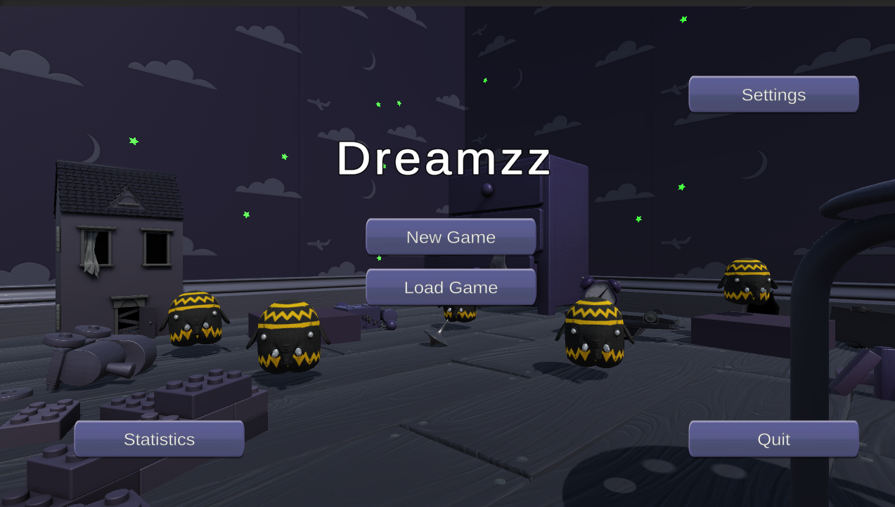
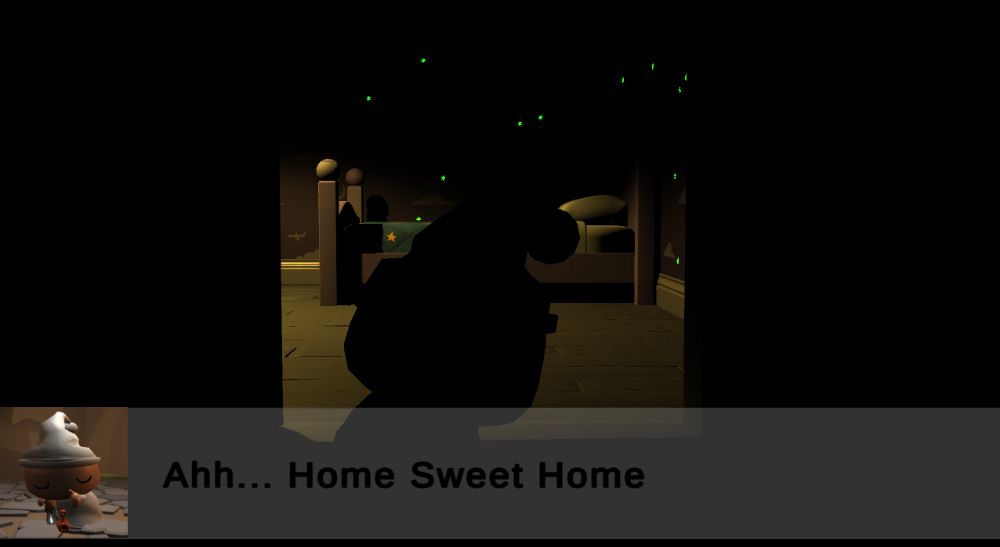
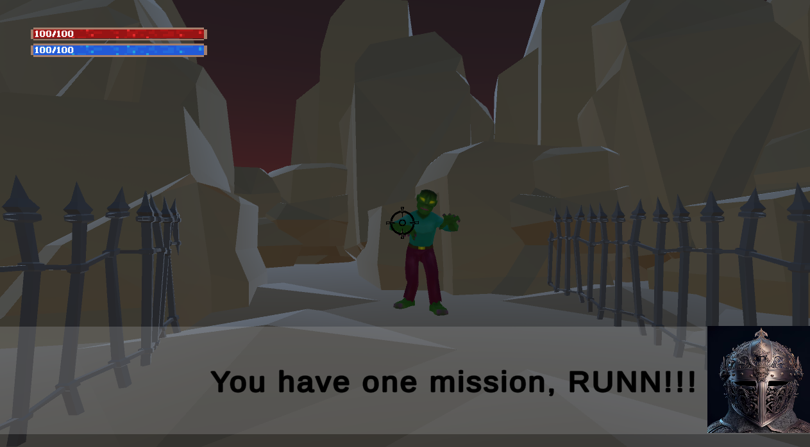
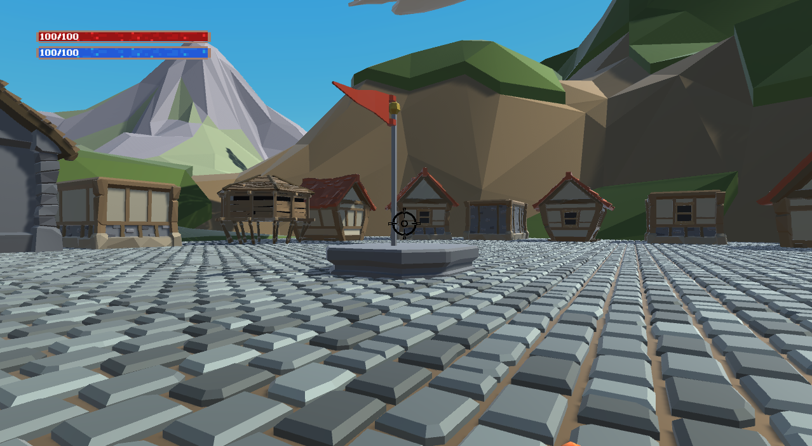
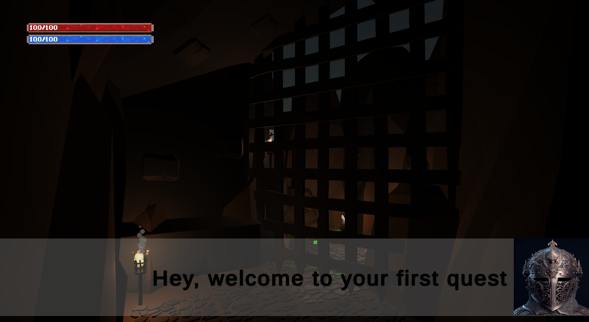
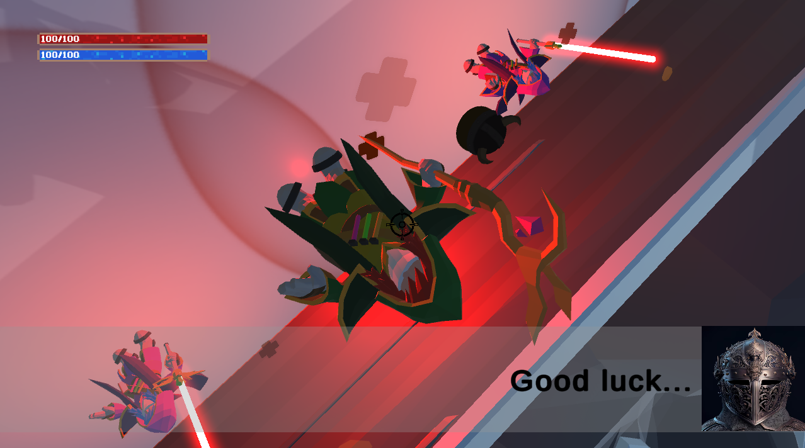
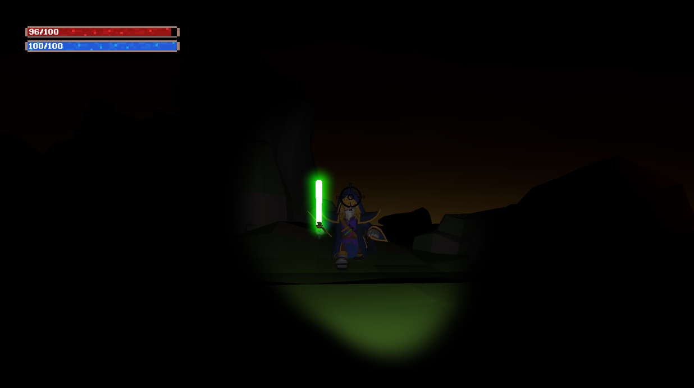
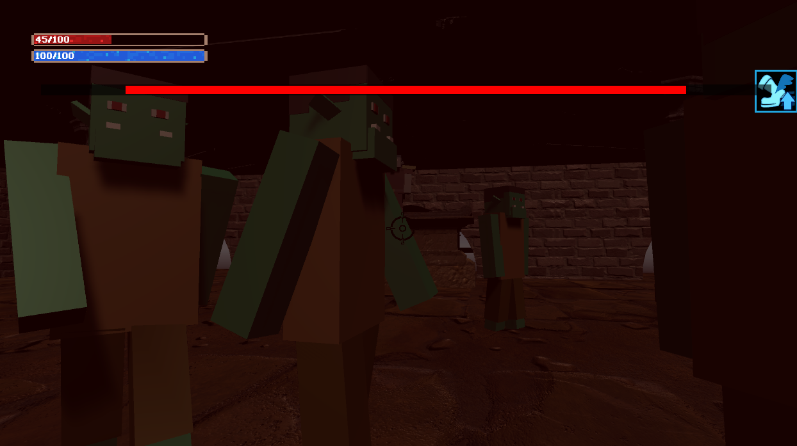
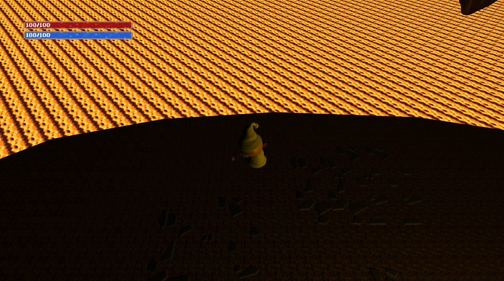

# Tugas Besar Unity ANY
| NIM | Nama |
| --- | ---- |
| 13521004 | Henry Anand Septian Radityo |
| 13521007 | Matthew Mahendra |
| 13521009 | Christophorus Dharma Winata |
| 13521012 | Haikal Ardzi Shofiyurrohman |
| 13521015 | Hidayatullah Wildan Ghaly Buchary |

## Deskripsi Game
Game yang dibuat mengikuti kisah seorang yang sedang bermimpi tentang peperangan. Terdapat beberapa quest yang harus dilalui oleh sang pemain. Selama permainan, pemain akan dibekali dengan tiga senjata: rifle, shotgun, dan knife.

Pemain akan mendapatkan koin untuk setiap musuh yang dikalahkan dan setiap quest yang diselesaikan. Koin dapat digunakan untuk membeli pet yang dapat menemani pemain dalam menyelesaikan quest. Selain itu, terdapat orb power up yang dapat digunakan ketika berhasil mengalahkan musuh.

## Library yang Digunakan
Aplikasi yang dibangun menggunakan library:
1. Unity (Game Engine)
2. Blocky Custom Character (Asset)
3. Kawaii Slimes (Asset)
4. Horror Starter Pack (Asset)
5. Mobile Game GUI Vector Pack

## Screenshot Game
### Main Menu

### Opening

### Maze

### Main Hall

### Quest and Scene Introduction

### Quest and Scene Village Liberation

### Quest and Scene Escort

### Quest and Scene Statue

### Quest and Scene Parkour

## Pembagian Kerja dan Jam Kerja
| NIM | Tugas | Waktu Persiapan | Waktu Pengerjaan |
| --- | ----- | --------------- | ---------------- |
| 13521004 | Scene dan Quest Maze, Pet Shop, Pet, Mob Zombie | 3 jam | 20 jam |
| 13521007 | Scene dan Quest Statue, Game Load, Game Save, Game Statistics | 3 jam | 20 jam |
| 13521009 | Scene dan Quest Parkour, Scene Opening, Scene Closing, Game Cheats | 3 jam | 20 jam |
| 13521012 | Scene dan Quest Escort, Pet, Game Over, Main Menu | 3 jam | 20 jam |
| 13521015 | Scene dan Quest Village, Scene dan Quest Intro, Pet, Setup, Orb, Weapon | 5 jam | 22 jam |
